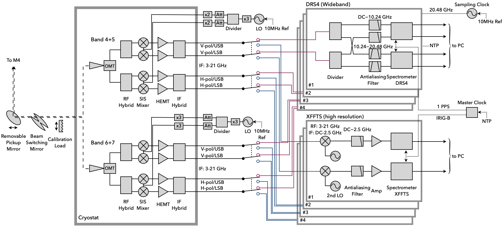

## Specifications summary (as of 2022 June)
| General | |
|---|---|
| Number of bands | 2 (Band 4+5 and 6+7) |
| Number of beams per band | 1 |
| Number of polarizations per band | 2 |
| Number of sidebands per band | 2 |

| Spec | Low Frequency Band | High Frequency Band |
|---|---|---|
| Radio frequency | 120−210 GHz | 210−350 GHz|
| Radio frequency | 4-20.48 GHz | 4-20.48 GHz |
| System noise temperature | | |

## System overview
FINER consists of two SIS receivers.

**Figure. Block diagram.**

### Optics
Single beam.

### Front-end receiver
The front-end receiver exploits the high critical current density SIS mixer technology ([Kojima et al. 2017](https://ui.adsabs.harvard.edu/abs/2017ITTST...7..694K/), [2020](https://ui.adsabs.harvard.edu/abs/2020A%26A...640L...9K/)) for ALMA 2 (future ALMA), which allows us to have a wide instantaneous frequency coverage.

### Back-end spectrometer
FINER has two sets of digital spectrometers with different spectral resolutions and bandwidths. 

- Wide-band spectrometers (DRS4, ELECS Inc.). Analog IF input is digitized by a set of 3-bit 20.48 GSa/s analog-to-digital converters (ADCs), each of which offers a 10.24 GHz bandwidth with a 20 MHz spectral resolution.
- High-resolution spectrometers (XFFTS, RPG). spectroscopy is offered by the array of 2.5-GHz digital spectrometers, XFFTS (RPG).

### Data analysis software & Data format

## Technical document

